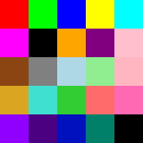

# Palette Texture Generator

A CLI tool to generate a palette texture from a list of hex colors. Each color is rendered as a tile in a grid, creating a simple and seamless palette texture.



## Usage

### Installation

1. Clone the repository:
```bash
git clone https://github.com/yourusername/palette-texture-generator.git
cd palette-texture-generator
```

2. Build using Rust:
```bash
cargo build --release
```

3. Run the tool (from project directory):
```bash
./target/release/palette-texture-gen <COLORS> [OPTIONS]
```

### CLI Options

#### Required Argument

- Hex colors separated by commas.
  Example: `FF0000,00FF00,0000FF,FFFF00`

#### Optional Flags
- `--size` or `-s`: Size of palette square in pixels. Default is `5`.
  Example: `--size 10`

- `--out` or `-o`: Output path for the generated texture. Default is `palette-texture.png`.
  Example: `--out my-palette.png`

### Example

The example texture in this project was generated using this command:

```bash
./target/release/palette-texture-gen FF0000,00FF00,0000FF,FFFF00,00FFFF,FF00FF,000000,FFA500,800080,FFC0CB,8B4513,808080,ADD8E6,90EE90,FFB6C1,DAA520,40E0D0,32CD32,FF6B6B,FF69B4,8F00FF,4B0082,0012BE,008069 --size=32 --out=example.png
```
